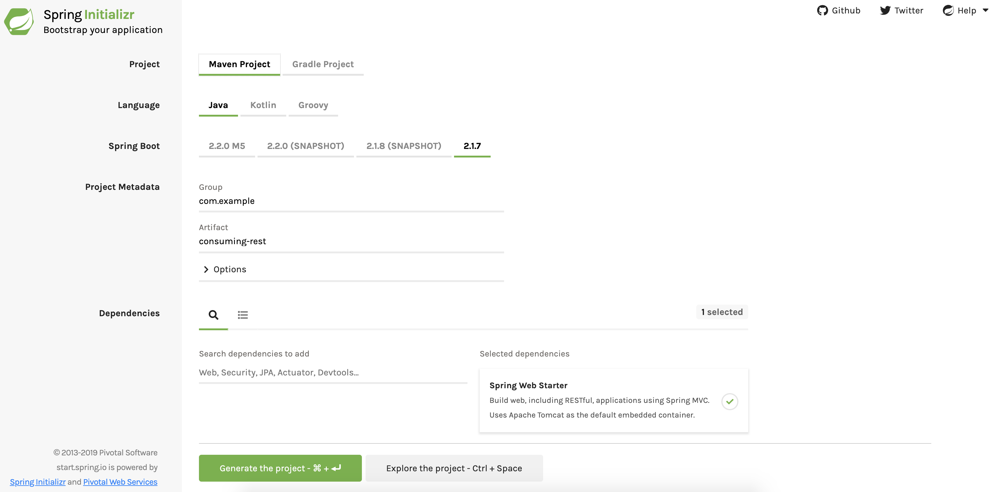

:spring_boot_version: 2.2.1.RELEASE
:project_id:iTune-rest

This guide walks you through the process of creating an application that consumes a
RESTful web service.

== What You Will Build

You will build an application that uses Spring's `RestTemplate` to retrieve a artists
https://itunes.apple.com/search

== What You Need

:java_version: 1.8
include::https://raw.githubusercontent.com/spring-guides/getting-started-macros/master/prereq_editor_jdk_buildtools.adoc[]

include::https://raw.githubusercontent.com/spring-guides/getting-started-macros/master/how_to_complete_this_guide.adoc[]

[[scratch]]
== Starting with Spring Initializr

For all Spring applications, you should start with the https://start.spring.io[Spring
Initializr]. The Initializr offers a fast way to pull in all the dependencies you need for
an application and does a lot of the set up for you. Because this example needs to be
nothing more than a web application, you need to include only the Web dependency. The
following image shows the Initializr set up for this sample project:

The following listing shows the `pom.xml` file created when you choose Maven:

====
[src,xml]
----
<?xml version="1.0" encoding="UTF-8"?>
<project xmlns="http://maven.apache.org/POM/4.0.0" xmlns:xsi="http://www.w3.org/2001/XMLSchema-instance"
	xsi:schemaLocation="http://maven.apache.org/POM/4.0.0 https://maven.apache.org/xsd/maven-4.0.0.xsd">
	<modelVersion>4.0.0</modelVersion>
	<parent>
		<groupId>org.springframework.boot</groupId>
		<artifactId>spring-boot-starter-parent</artifactId>
		<version>2.1.7.RELEASE</version>
		<relativePath/> <!-- lookup parent from repository -->
	</parent>
	<groupId>com.cgi</groupId>
	<artifactId>itune-rest-client</artifactId>
	<version>0.0.1-SNAPSHOT</version>
	<name>iTune-rest</name>

	<properties>
		<java.version>1.8</java.version>
	</properties>

	<dependencies>
		<dependency>
			<groupId>org.springframework.boot</groupId>
			<artifactId>spring-boot-starter-web</artifactId>
		</dependency>

		<dependency>
			<groupId>org.springframework.boot</groupId>
			<artifactId>spring-boot-starter-test</artifactId>
			<scope>test</scope>
		</dependency>
	</dependencies>

	<build>
		<plugins>
			<plugin>
				<groupId>org.springframework.boot</groupId>
				<artifactId>spring-boot-maven-plugin</artifactId>
			</plugin>
		</plugins>
	</build>

</project>

----
====

group = 'com.cgi'
version = '0.0.1-SNAPSHOT'
sourceCompatibility = '1.8'

repositories {
	mavenCentral()
}

dependencies {
	implementation 'org.springframework.boot:spring-boot-starter-web'
	testImplementation 'org.springframework.boot:spring-boot-starter-test'
}
----
====

These build files can be this simple because `spring-boot-starter-web` includes everything
you need to build a web application, including the Jackson classes you need to work with
JSON.

[[initial]]
== Fetching a REST Resource

With project setup complete, you can create a simple application that consumes a RESTful
service.

A RESTful service has been stood up at https://itunes.apple.com/search?term=jack+johnson
It randomly fetches quotations about Spring Boot and returns them as JSON documents.

If you request that URL through your a web browser or curl, you receive a JSON document
that looks something like this:

====
[source,java,tabsize=2script]
----
{"wrapperType":"track",
 "kind":"song",
 "artistId":909253,
 "collectionId":120954021,
 "trackId":120954025,
 "artistName":"Jack Johnson",
 "collectionName":"Sing-a-Longs and Lullabies for the Film Curious George",
 "trackName":"Upside Down",
 "collectionCensoredName":"Sing-a-Longs and Lullabies for the Film Curious George",
 "trackCensoredName":"Upside Down",
 "artistViewUrl":"https://itunes.apple.com/WebObjects/MZStore.woa/wa/viewArtist?id=909253",
 "collectionViewUrl":"https://itunes.apple.com/WebObjects/MZStore.woa/wa/viewAlbum?i=120954025&id=120954021&s=143441",
 "trackViewUrl":"https://itunes.apple.com/WebObjects/MZStore.woa/wa/viewAlbum?i=120954025&id=120954021&s=143441",
 "previewUrl":"http://a1099.itunes.apple.com/r10/Music/f9/54/43/mzi.gqvqlvcq.aac.p.m4p",
 "artworkUrl60":"http://a1.itunes.apple.com/r10/Music/3b/6a/33/mzi.qzdqwsel.60x60-50.jpg",
 "artworkUrl100":"http://a1.itunes.apple.com/r10/Music/3b/6a/33/mzi.qzdqwsel.100x100-75.jpg",
 "collectionPrice":10.99,
 "trackPrice":0.99,
 "collectionExplicitness":"notExplicit",
 "trackExplicitness":"notExplicit",
 "discCount":1,
 "discNumber":1,
 "trackCount":14,
 "trackNumber":1,
 "trackTimeMillis":210743,
 "country":"USA",
 "currency":"USD",
 "primaryGenreName":"Rock"}}
----
====

That is easy enough but not terribly useful when fetched through a browser or through curl.

A more useful way to consume a REST web service is programmatically. To help you with that
task, Spring provides a convenient template class called {RestTemplate}[`RestTemplate`].
`RestTemplate` makes interacting with most RESTful services a one-line incantation. And it
can even bind that data to custom domain types.

First, you need to create a entities classes to contain the data that you need. The following
listing shows the `Quote` class, which you can use as your domain class:

`src/main/java/com/cgi/itune/ITunesCollection.java`
'src/main/java/com/cgi/itune/ITuneResponse.java'

This simple Java class has a handful of properties and matching
getter methods. It is annotated with `@JsonIgnoreProperties` from the Jackson JSON
processing library to indicate that any properties not bound in this type should be ignored.

To directly bind your data to your custom types, you need to specify the
variable name to be exactly the same as the key in the JSON document returned from the API.
In case your variable name and key in JSON doc do not match, you can use `@JsonProperty`
annotation to specify the exact key of the JSON document. (This example matches each
variable name to a JSON key, so do not need that annotation here.)

This uses the same annotations but maps onto other data fields.

== Finishing the Application

The Initalizr creates a class with a `main()` method. The following listing shows the
class the Initializr creates (at
`src/main/jjava/com/cgi/itune/ITuneRestClientApplication.java`):

====
[src,Java]
----
include::initial/src/main/java/com/cgi/itune//ITuneRestClientApplication.java[]
----
====

Now you need to add a few other things to the `ITuneRestClientApplication` class to get it to
show quotations from our RESTful source. You need to add:

* A logger, to send output to the log (the console, in this example).
* A `RestTemplate`, which uses the Jackson JSON processing library to process the incoming
data.
* A `CommandLineRunner` that runs the `RestTemplate` (and, consequently, fetches our
quotation) on startup.

The following listing shows the finished `ITuneRestClientApplication` class (at
`complete\src\main\java\com\cgi\itune/ITuneRestClientApplication.java`):

====
[src,Java]
----
include::complete/src/main/java/com/cgi/itune/ITuneRestClientApplication.java[]
----
====

== Running the Application

java -jar itune-rest-client-0.0.1-SNAPSHOT.jar "Jim Jones"

You should see output similar to the following
 Showing Tracks for Jack Smith:
Bodies in Barrels: The Snowtown Murders (Unabridged), null, Nonfiction,
null, On Moonlight Bay, Comedy,
The Happy Face Murderer: The Life of Serial Killer Keith Hunter Jesperson (Unabridged), null, Nonfiction,
1970s: A Decade of Serial Killers: The Most Evil Serial Killers of the 1970s  (Unabridged), null, Nonfiction,
The Spokane Killer: The Life of Serial Killer Robert Lee Yates Jr. (Unabridged), null, Biographies & Memoirs,
null, Inside Out (2015), Kids & Family,
? - ?????, It (2017), Horror,
The Double Life of a Serial Murderer: The Life of Serial Killer Herb Baumeister (Unabridged), null, Nonfiction,
God and Mr. Gomez, null, Biographies & Memoirs,
MIB 4- Movie Collection, Men In Black 3, Action & Adventure,
The Casanova Killer: The Life of Serial Killer Paul John Knowles (Unabridged), null, Biographies & Memoirs,
1980s - A Decade of Serial Killers: The Most Evil Serial Killers of the 1980s (American Serial Killer Anthology by Decade, Book 1) (Unabridged), null, Biographies & Memoirs,
Men In Black 4-Movie Collection, Men In Black, Action & Adventure,
Men in Black 4 Movie Collection, Men In Black II, Action & Adventure,
null, 12 Strong, Drama,
10 Iconic Films of the 00's, School of Rock, Comedy,
null, Shark Tale, Kids & Family,
10 Iconic Films from the 70's, The Great Gatsby (1974), Drama,
10 Years of iTunes Movies - Sony Pictures, The Pursuit of Happyness, Drama,
null, The House Bunny, Comedy,
Jack Black 3 Movie Collection, Nacho Libre, Comedy,
Inside Llewyn Davis + Another Day / Another Time: Celebrating the Music of "Inside Llewyn Davis", Another Day/Another Time: Celebrating the Music of "Inside Llewyn Davis", Documentary,
null, Only the Brave, Action & Adventure,
null, Dragged Across Concrete, Action & Adventure,
null, Friday Night Lights, Drama,
Transmission, Jack Smith, Pop,
null, Tombstone, Western,
Jack And The Beanstalk & Other Stories (Unabridged), null, Kids & Young Adults,
Day Time on the Radio: Lost Radio Duets From the Doris Day Show (1952-1953), I'm Forever Blowing Bubbles, Pop,
null, Pride & Prejudice & Zombies, Comedy,
Big Hits Highlights of 1951, Vol. 1, I'm Forever Blowing Bubbles, Pop,
The Great Gatsby (Music from Baz Luhrmann's Film) [Deluxe Edition], Love Is Blindness, Soundtrack,
Blunderbuss, Love Interruption, Alternative,
More Life, Get It Together (feat. Black Coffee & Jorja Smith), Hip-Hop/Rap,
null, View from a Blue Moon, Sports,
null, It Might Get Loud, Music Documentaries,
Blunderbuss, I'm Shakin', Alternative,
null, The Untouchables, Action & Adventure,
null, City Slickers, Comedy,
Romance Movie Collection, Last Holiday, Comedy,
The Bayou Killer: Life of Serial Killer Ronald J. Dominique (Unabridged), null, Biographies & Memoirs,
Blunderbuss, Freedom At 21, Alternative,
Blunderbuss, Sixteen Saltines, Alternative,
Blunderbuss, Trash Tongue Talker, Alternative,
Lazaretto, Lazaretto, Alternative,
Blunderbuss, Blunderbuss, Alternative,
Blunderbuss, Missing Pieces, Alternative,
Blunderbuss, Hypocritical Kiss, Alternative,
Blunderbuss, Take Me With You When You Go, Alternative,
Blunderbuss, Hip (Eponymous) Poor Boy, Alternative,

